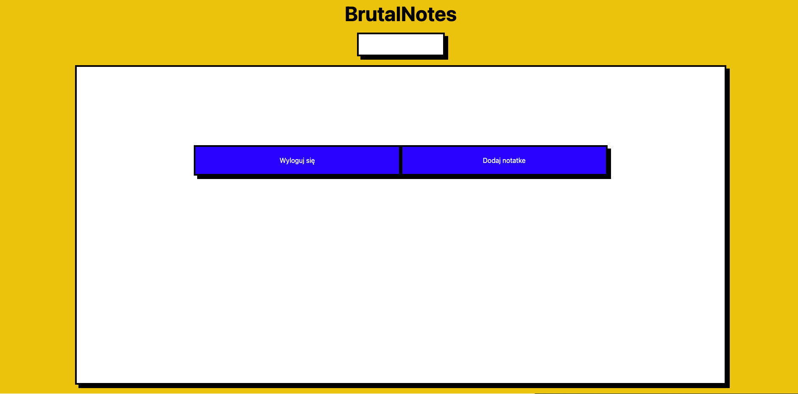

# BrutalNotes, how to use?
Upon visiting the site you are greeted with login form. If you don't have an account, create one!

Click the `Nie masz konta? Kliknij tutaj!`
To navigate to the register page.

If you already have an account, you can skip the next step!

# Registering an account
In order to register an account you need to pass following:

1. A valid email address
1. Your Name!
1. A very secret password that only you will know 

After inputing all of the above, press register!

Congratulations you should be now part of the BrutalNotes family!

# Main screen

Welcome to the main screen of BrutalNotes!
This view consists of your notes (max 4 per page), search bar to search through your notes with meilisearch, logout button, and add note button

As of now it may seem empty. Lets add some notes to populate it!

Click the `Dodaj notatke` button

This is the addNote view. The big textarea is where you put contents of your note.
If you want it to be a part of category, click the `Dodaj kategorie` button, and write desired category

Finished? Hit that `Stwórz notatkę!` button to save your work.

If you decide to change the note content after creating, click on the note. Edit note view is similar to addNote, so you shouldn't have any problems by now ;) Clicking `X` in the upper right corner will delete your note, so be carefull! Click the category to edit it

You can use the search bar right under the brutal notes logo to search through all your notes

## Happy using!

